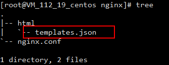
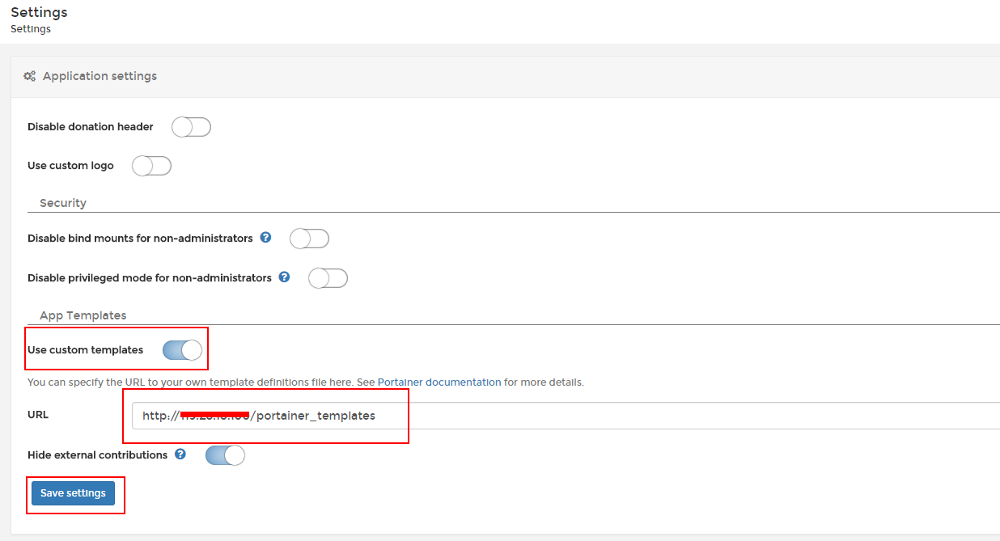

# portainer-templates
App Templates for Portainer

## 使用
1.安装Docker

2.安装portainer [文档](https://portainer.readthedocs.io/en/stable/deployment.html)

3.把 portainer-templates/templates.json 放在Nginx 下，配置可以访问，如下：



```
location = /portainer_templates {
    default_type application/json;
    root ./html;
    try_files /templates.json =404;
}
```

4.打开 Portainer Settings,按下图操作：



5.打开 Portainer App Templates 即可看到刚才添加的 template 
  


